<!-- Banner Header -->

<!-- Typing Animation -->

<!-- Dynamic Badges -->

  
  

---

## ⚡ About Me

  🎓 Engineering Student passionate about **Software Development & Artificial Intelligence**
                                                                              
  💻 Full Stack Developer working with **Java, Python & modern web technologies**
                                                                              
  ⚙️ Backend Developer exploring **Spring Boot, Microservices & RESTful APIs**  
                                                                              
  🧠 Strengthening problem-solving skills through **Advanced DSA & OOP**          
                                                                              
  🏗️ Learning **System Design & Distributed Systems** for scalable applications  
                                                                             
  🤖 Diving deeper into **AI, Machine Learning & Advanced Deep Learning**        
                                                                              
  🚀 Aspiring AI/ML Engineer focused on building real-world intelligent apps 

  ----

## 🎓 Education

| 🎓 Education | 🏫 Institution | 📅 Duration | 📊 Grade | 📚 Stream |
|:---|:---|:---:|:---:|:---|
| **Bachelor of Technology** | **Invertis University** | 2024 – 2028 | ⭐ **A+ (Till Now)** | Computer Science |
| **Class XII** | **Unique Model Inter College** | 2023 | 🏆 **80%** | PCM |
| **Class X** | **Unique Model Inter College** | 2021 | 🏆 **91%** | PCM |

 

🎯 **Currently pursuing Computer Science with a focus on Software Development, Backend Engineering & AI/ML.**

---
  
## 🛠️ Skills

### 1️⃣ Programming

• `Python` • `Java` • `JavaScript` • `TypeScript`

----

### 2️⃣ Core CSE & DSA

• `Operating Systems` • `Computer Networks` • `DBMS` • `OOP`

• `DSA` • `Dynamic Programming` • `Distributed Systems`

• `Digital Logic` • `Automata Theory`

----

### 3️⃣ Development

#### 🌐 i) Frontend

• `HTML` • `CSS` • `Tailwind CSS` • `Bootstrap` • `ReactJS`

#### ⚙️ ii) Backend

• `Spring Boot` • `Spring Framework` • `JDBC`

• `Hibernate` • `JPA` • `Spring MVC` • `RESTful API`

#### 🗄️ iii) Database

• `MySQL` • `PostgreSQL` • `MongoDB`

----

### 🤖 4️⃣ AI/ML & Data Science

• `Power BI` • `SQL` • `Excel`

• `NumPy` • `Pandas` • `Matplotlib` • `Seaborn` • `Scikit-learn`

• `TensorFlow` • `PyTorch`

---

### ☁️ 5️⃣ Deployment & Infrastructure      

• `Docker` • `Kubernetes` • `Kafka`

• `AWS` • `Git` • `GitHub`

----

### 💻 6️⃣ Platforms & Development Tools

• `VS Code` • `IntelliJ IDEA` • `Jupyter Notebook`

---

## 🚀 Projects

### 1️⃣ Life Insurance Claim Predictor

**Machine Learning Project**

An ML-based project focused on predicting **life insurance claim outcomes** using data-driven techniques.

**Technologies:**

• `Python` • `NumPy` • `Pandas` • `Matplotlib`

• `Seaborn` • `Scikit-learn` • `Machine Learning`

**🔗 Project Links:**

&nbsp;&nbsp;

-----

### 2️⃣ Smart Indoor Energy Optimization

**IoT Project**

A smart indoor energy optimization system designed to improve **energy efficiency using IoT-based monitoring and intelligent control**.

**Technologies:**

• `IoT` • `Energy Optimization` • `Smart Systems`

• `Automation` • `Data Analysis` • `C++`

**🔗 Project Links:**

&nbsp;&nbsp;

---

## 📈 GitHub Analytics

---

## 🐍 Contribution Snake

<picture>
  <source
    media="(prefers-color-scheme: dark)"
    srcset="https://raw.githubusercontent.com/ayush-gangwar-09/ayush-gangwar-09/output/github-contribution-grid-snake-dark.svg"
  />

  <source
    media="(prefers-color-scheme: light)"
    srcset="https://raw.githubusercontent.com/ayush-gangwar-09/ayush-gangwar-09/output/github-contribution-grid-snake.svg"
  />

  

</picture>

---

## 🎯 2026 Goals

 **🚀 Learn deeply. Build consistently. Think at scale.**

- 🧠 **Master Advanced DSA**  
  Strengthen problem-solving, algorithms & competitive thinking.

- ⚙️ **Advanced Backend Development**  
  Build robust applications with Spring Boot, REST APIs & Microservices.

- 🏗️ **Level Up System Design**  
  Learn scalable architecture, design patterns & high-level system thinking.

- 🌐 **Deep Dive into Distributed Systems**  
  Understand scalability, reliability, concurrency & distributed architecture.

- 🤖 **Master Advanced AI**  
  Explore modern AI concepts and intelligent application development.

- 🧬 **Go Deeper into Deep Learning**  
  Strengthen neural networks, model development & practical applications.

- 🚀 **Build Impactful Real-World Projects**  
  Turn ideas into practical, scalable & meaningful solutions.

---

## 🧠 Developer Philosophy

### *"Don't just write code. Understand the system behind it."*

 

**💻 Code with Purpose**  
Build solutions that solve real problems.

**🧠 Think Deeply**  
Understand the logic before writing the code.

**🏗️ Design for Scale**  
Build systems that can grow with users and requirements.

**🤖 Build Intelligent Systems**  
Combine software engineering with AI to create smarter solutions.

**🚀 Keep Evolving**  
Learn continuously, experiment often, and improve every day.

 

 **Learn → Build → Break → Understand → Improve → Repeat 🔁**

---

## 🤝 Connect With Me

  <b>Let's connect, collaborate, and build something impactful together! 🚀</b>

 

&nbsp;&nbsp;

💻 Full Stack Development • 🤖 AI/ML • 🚀 Open to Collaboration

---

### ⭐ Thanks for visiting my profile!

  <b>Keep Learning • Keep Building • Keep Growing 🚀</b>

  💻 Code with Purpose • 🤖 Learn with Curiosity • 🚀 Build with Impact

Made with ❤️ & lots of ☕

